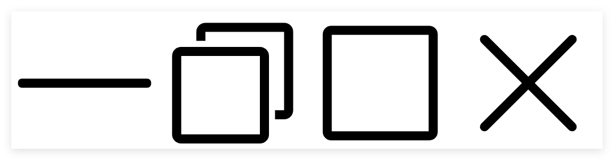

# 图标

`LightCode`预设了少量图标供开发者使用，后续根据开发需要逐步增加。

目前主要包含窗口的`最小化`、`普通窗口`、`最大化`、`关闭`四个按钮图标，图标以`SVG`形式提供，可以在`CSS`中引用，或者是通过`AJAX`获取。



图标路径格式：`/windows/ctrl_[type].svg`，其中`[type]`表示图标类型，下面介绍当前包含的不同`[type]`

## 最小化
- **type**: `min`
- **路径**: `/windows/ctrl_min.svg`

## 恢复普通窗口
- **type**: `norm`
- **路径**: `/windows/ctrl_norm.svg`

## 最大化
- **type**: `max`
- **路径**: `/windows/ctrl_max.svg`

## 关闭
- **type**: `close`
- **路径**: `/windows/ctrl_close.svg`

## 获取图标示例
以`AJAX`为例，获取图标示例如下：
```javascript
getWindowsCtrlIconSVG(type, cb) {
    fetch(`/windows/ctrl_${type}.svg`)
        .then(response => {
            cb && cb(response.text());
        })
        .catch(error => {
            console.error('Error fetching data:', error);
        });
}
```
考虑到`最小化`、`普通窗口`、`最大化`、`关闭`这`4`个图标常常是一起搭配使用，`LightCode`提供了一个接口，可以同时获取这4个SVG

- `/windows/all_ctrl.svg`: 返回`4`个`svg`文本，通过`\n`间隔，顺序为：`最小化`、`普通窗口`、`最大化`、`关闭`。