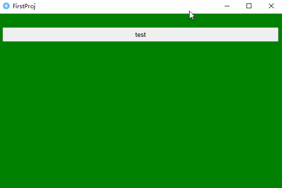

# 调用dll
`WinJS`提供了一些`Native`接口，但无法满足所有开发者的需求，因此，特地提供了提供调用`C/C++`的能力。

开发者可以使用`C/C++`开发**复杂的、耗时的、定制化的**功能，然后在`javascript`中轻松调用。

---

## invokeDll

调用`dll`文件内的函数：
```javascript
invokeDll(dllFileName: string, funcName: string, proto: string, ...args): any;
```
- **dllFileName：** 字符串类型，指定`dll`文件名称。注意，这里是名称而不是路径。
- **funcName：** 字符串类型，调用`dll`内的目标函数名称。
- **proto：** 字符串类型，目标函数的函数原型。
- **...args：** 可变参数，传给目标函数的参数，注意参数**类型**和**数量**需要与`proto`定义的一致。

> 需要注意的是，当前只支持如下几种参数/返回类型：
> - int：整数
> - float：浮点数
> - str：字符串
> - ptr：指针
>
> 如果无参数，则无需设置参数；如果无返回值，则可以使用`void`.例如一个无参数无返回值的函数原型定义：`void()`.

## 调用示例
目标函数原型定义非常简单，按照`C语言`的原型格式即可。以调用Windows系统的`MessageBoxA`函数为例，该函数在`user32.dll`文件中，且其函数原型为`void(int,str,str,int)`。那么，在`javascript`中调用该函数如下：
```javascript
Native.invokeDll("user32.dll", "MessageBoxA", "void(int,str,str,int)", 0, "内容", "标题" , 64);
```
> 注意：如果需要加载指定目录的dll文件，需要将dll所在的目录加入到环境变量。

例如，将`D:\MyWork\FirstWinJSProj`加入到环境变量，调用如下代码：
```javascript
Native.addSysPath("D:\\MyWork\\FirstWinJSProj")
```
---

## 指针类型
`WinJS`允许你传入或返回指针类型，在函数原型中对应`ptr`。指针类型在`C/C++`中对应为`void*`，在`Javascript`中对应为`整数类型`。

对于复杂的数据结构，开发者可以在`C/C++`中将其封装成`struct`或`class`，然后通过指针的方式与`javascript`相互调用。

## 项目实战
接下来以实际例子演示如何调用`dll`，主要分为2步：
1. 创建`dll`
2. 在`javascript`中调用`dll`

### 1. dll开发
为了更有代表性，我们创建一个包含`int`、`float`、`str`、`ptr`类型的调用。在`VisualStudio`中创建`dll`项目，项目中包含如下两个文件：

`pch.h`头文件：
```CPP
#ifndef PCH_H
#define PCH_H

#define WIN32_LEAN_AND_MEAN   // 从 Windows 头文件中排除极少使用的内容

#include <windows.h>
#include <string>

#ifdef MYDLL_EXPORTS
#define MYDLL_API __declspec(dllexport)
#else
#define MYDLL_API __declspec(dllimport)
#endif

class MyClass {
private:
	int intV;
	float floatV;
	std::string strV;

public:
	MyClass(int i, float f, const std::string& s) :intV(i),floatV(f),strV(s){};
	~MyClass() {};
	int add(int i) { return intV + i; };
	float add(float f) { return floatV + f; };
	const char* add(std::string s) { strV = strV + s; return strV.c_str(); };
};

extern "C" {
	MYDLL_API void* newClass(int i, float f, const char* s);
	MYDLL_API int addI(void* ptr, int i);
	MYDLL_API float addF(void* ptr, float f);
	MYDLL_API const char* addS(void* ptr, const char* s);
}
#endif //PCH_H

```

`dllmain.cpp`文件
```CPP
#include "pch.h"

BOOL APIENTRY DllMain(HMODULE hModule,
	DWORD  ul_reason_for_call,
	LPVOID lpReserved
)
{
	switch (ul_reason_for_call)
	{
	case DLL_PROCESS_ATTACH:
	case DLL_THREAD_ATTACH:
	case DLL_THREAD_DETACH:
	case DLL_PROCESS_DETACH:
		break;
	}
	return TRUE;
}

void* newClass(int i, float f, const char* s) {
	MyClass* ptr = new MyClass(i, f, s);
	return ptr;
}

int addI(void* ptr, int i) {
	MyClass* cls = (MyClass*)ptr;
	return cls->add(i);
}
float addF(void* ptr, float f) {
	MyClass* cls = (MyClass*)ptr;
	return cls->add(f);
}
const char* addS(void* ptr, const char* s) {
	MyClass* cls = (MyClass*)ptr;
	return cls->add(s);
}
```
编译后，生成`TestDll.dll`文件。
> 思考：`TestDll.dll`文件该放哪里？
> 分多个场景：
> 1. 调试场景：放入到WinJS.exe相同级目录或`project.json`相同级目录.
> 2. 打包场景：该文件不要放入到`project.json`目录，以防被一起打包到exe中。如果想要放入到`project.json`同级目录，则将该文件名加入到`project.json`的`exclude`列表内。
> 3. 任意场景：将该文件拷贝到指定的目录`/path/to/dir`中，然后调用`Native.addSysPath(/path/to/dir)`函数，将该目录临时加入到环境变量中。
### 2. 界面开发
在`javascript`中，通过指定`dll`文件名为`TestDll.dll`并指定对应的函数及其原型和参数，完成函数的调用。
```html
<html>

<head>
    <style>
        body {color:#fff; display: flex;justify-content: center;background-color: green;flex-direction: column;}
        button{height:30px;margin-top:20px;}
    </style>
    <script>
        function test() {
            let outDiv = document.getElementById("out");
            let ptr = Native.invokeDll("TestDll.dll", "newClass", "ptr(int,float,str)", 11, 2.2, "Hello, WinJS!");
            outDiv.innerHTML += "<div>MyClass pointer:" + ptr + "</div>";
            let addIOut = Native.invokeDll("TestDll.dll", "addI", "int(ptr,int)", ptr, 22);
            outDiv.innerHTML += "<div>11 + 22 = " + addIOut + "</div>";
            let addFOut = Native.invokeDll("TestDll.dll", "addF", "float(ptr,float)", ptr, 1.1);
            outDiv.innerHTML += "<div>2.2 + 1.1 = " + addFOut + "</div>";
            let addSOut = Native.invokeDll("TestDll.dll", "addS", "str(ptr,str)", ptr, "Hello World!");
            outDiv.innerHTML += '<div>"Hello, WinJS!" + "Hello World!" = ' + addSOut + "</div><hr>";
        }
    </script>
</head>

<body>
    <div id="out"></div>
    <button onclick="test()">test</button>
</body>

</html>
```
### 3. 调试运行
运行:
```bash
C:\WinJS.exe -d D:\MyWork\FirstWinJSProj
```
启动界面调试，如下所示：




