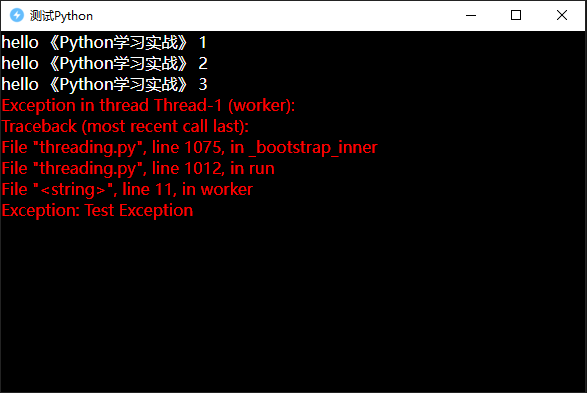

# Python快速开始

## Python环境准备
在使用`Python`之前，需要下载好`Python`环境。在`project.json`文件中设置`Python版本`、`Python下载镜像`、`PIP镜像`，如下所示:
```json
{
    //其他略...
    "pyVersion":"3.12.9",
    "pythonProxy":"",
    "pipProxy":""
}
```
- **pyVersion：** 指定使用的`python`版本。
- **pythonProxy：** 指定下载`python`的镜像，如果为空，则默认从`https://mirrors.aliyun.com/python-release/windows`中下载。
- **pipProxy：** 指定使用pip安装库时使用的镜像，如果为空则默认从`https://mirrors.aliyun.com/pypi/simple/`中下载。

有了以上配置后，接下来可以如下命令完成Python安装以及安装指定库。首先，需要使用如下命令创建项目：

## 创建项目
```shell
LightCode.exe -d -w D:\MyWork\test_python
```
其中`D:\MyWork\test_python`是创建的项目路径。

## 安装Python
```shell
LightCode.exe -e -w D:\MyWork\test_python
```
执行如上命令后，完成安装，输出如下日志：
```log
LightCode.exe -e -w D:\MyWork\test_python
[2025-03-15 13:57:28] >>> 正在下载Python 3.12.9: https://mirrors.aliyun.com/python-release/windows/python-3.12.9-embed-amd64.zip
[2025-03-15 13:57:29] <<< 下载Python完成...
[2025-03-15 13:57:29] >>> 正在安装Python 3.12.9 到 D:\MyWork\test_python
[2025-03-15 13:57:29] 【成功】已安装Python3.12.9
```

----

## 界面开发
在`D:\MyWork\test_python`中创建`index.html`, 内容如下：
```html
<html>

<head>
    <style>
        html,
        body {
            margin: 0;
            padding: 0;
            background-color: black;
            color: #fff
        }
        red{color:red}
        white{color:white}
    </style>

</head>

<body>
    <div class="log" id="log"></div>
</body>
<script>
    // Native.openDevTools();//打开开发者工具
    function printLog(msg, isStdOut) {
        var line = document.createElement(isStdOut ? "white" : "red");
        line.innerText = msg;
        document.getElementById("log").appendChild(line)
    }
    Native.captureConsoleOutput(function (output, isStdOut) {
        printLog(output, isStdOut);
    })
    Native.initPython("3.12.9");
    Native.runPythonScript(`
import threading
import time

def worker():
    idx = 0
    while True:
        time.sleep(1)
        idx+=1
        if idx>3:
            raise Exception("Test Exception")
        print("hello 《Python学习实战》", idx)

thread = threading.Thread(target=worker, args=())
thread.start()
thread.join()
`);
</script>
</html>
```
以上代码模拟`Python`实际项目，模拟了如下任务：
- 整个`HTML`是个黑色界面，模拟控制台。并在JS中抓取`Python`的实时打印信息，然后在`web`页面显示。
- 开启一个Python异步线程运行任务
- `Python`线程中抛出一个异常

## 运行软件

```shell
LightCode.exe -d -w D:\MyWork\test_python
```
软件运行结果如下，可以看到，**抛出的异常也被抓到并显示**：



## 打包软件

打包时需要注意如下参数
```json
{
//....
"pkgResDir": true,
//...
}
```
`pkgResDir`参数表示是否将资源目录（即`.res`）一起打包到`exe`文件，需要注意的是，为了保证加载速度以及防止被杀毒软件误伤，资源文件不会做加密。因此像`dll`等文件推荐放入到`.res`目录中。

- 如果`pkgResDir`设置为`true`，则`.res`目录会被压缩并打包到`exe`文件。当资源文件比较小时，推荐使用`true`。
- 如果`pkgResDir`设置为`false`，则`.res`目录会拷贝到exe文件同级目录。当资源文件较大时，推荐`false`。

使用如下命令打包：
```shell
LightCode.exe -p -w D:\MyWork\test_python
```
由于我们的`demo`中的资源文件相对较小，因此打包到一个`exe`文件中，可以看到，将整个`python`虚拟机一起打包到`exe`后，大小只有`11M`左右。
