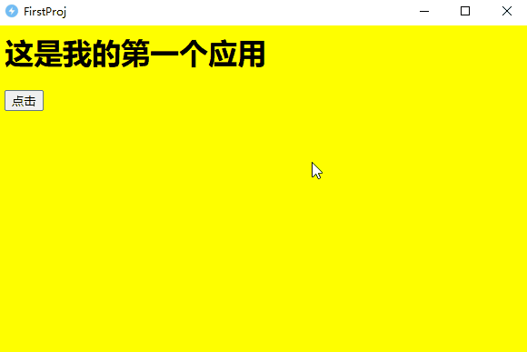

# 快速开始
# 1.开发环境
前往[https://lightcodesoft.github.io/](https://lightcodesoft.github.io/)下载最新的`LightCode`打包工具到本地，得到如下文件：
```
LightCode.exe
```
保存到本地，本文以`C:\LightCode.exe`为例。

# 2.配置文件
指定开发工作目录，以`D:\MyWork\FirstProj`为例，执行如下命令：
```
C:\LightCode.exe -d -w D:\MyWork\FirstProj
```
执行完成后，在`D:\MyWork\FirstProj`目录中生成`project.json`文件，默认内容如下：
```json
{
	"entry": "index.html",
	"width": 600,
	"height" : 400,
	"bgColor" : "#000000",
	"appNameCN" : "测试Python",
	"appNameEN" : "TestPython",
	"borderless" : false,
	"borderWidth" : 1,
	"borderColor" : "#FFFFFF",
	"ico" : "",
    "key": "",
	"fileVer" : "0.0.0.1",
	"productVer":"0.0.0.1-apha",
	"copyright":"Copyright(C) 2024-2025 LightCode",
    "companyName":"LightCode Company",
    "fileDesc":"这是个LightCode应用",
	"exclude":[".res","dist"],
    "pkgResDir": true,
	"pyDir":"py",
    "pyVersion":"3.12.9",
    "pythonProxy":"",
    "pipProxy":""
}
```
以上各个字段含义如下：
- **entry**：入口文件，即软件启动时的第一个html文件名。
- **width、height**：分别表示软件界面的宽和高。
- **bgColor**：软件默认背景颜色。
- **appNameCN**：软件中文名，用于显示中文名称。必须要设置。
- **appNameEN**：软件英文名，用于创建目录相关名称，如没有英文名，可以用拼音代替，必须要设置。
- **borderless**：boolean类型，是否去掉默认的标题栏和边界线。
- **borderWidth**：边界线的宽度，单位像素，只有当borderless=true时生效。
- **borderColor**：边界线的颜色，只有当borderless=true时生效。
- **ico**：软件图标文件路径。
- **key**：软件加密密码，如果设置了加密密码，打包后的软件需要卡密才能使用，生成卡密功能需要加入QQ群**1004749406**向群主索要。
- **fileVer**：软件版本。
- **productVer**：产品版本。
- **copyright**：版权信息。
- **companyName**：公司信息。
- **fileDesc**：软件描述。
- **exclude**：不打包进入exe的文件列表。
- **pkgResDir**：是否将资源目录即`.res`打包到`exe`。如果用到了`dll`文件，开发者需要把它放入到资源文件中，或者开发者自己管理`dll`路径。如果资源目录较大，建议设置为`false`。
- **pyDir**：存放开发者开发的`python`脚本目录，不建议把库放入这个目录，这个目录文件不宜过大，因为这个目录在打包时会自动编译`python`脚本为`.pyc`，同时也会删除`.py`文件，并且会加入加密保护，如果文件过大会导致解密加密耗时太长，也会导致内存占用较大。
- **pyVersion**：指定使用的`python`版本。
- **pipProxy**：指定`pip`镜像代理路径，如果为空则默认从`https://mirrors.aliyun.com/pypi/simple/`中下载。

# 3. 开发界面
创建`index.html`文件，内容如下：
```html
<html>

<body>
    <h1>这是我的第一个应用</h1>
</body>

</html>
```
`LightCode`提供了很多`Native`能力，并且还在持续扩充中。`LightCode`可以直接调用`dll`中的函数，为开发者提供了`js`调用`C/C++`能力，开发者可以将复杂耗时的功能用`C/C++`实现，`js+css`实现酷炫的界面。以调用`Windows`的系统提示窗口为例，修改`index.html`如下：
```html
<html>

<head>
    <script>
        let Native = window.Native;
        function myAlert(title, msg){
            //调用user32.dll中的MessageBoxA函数，该函数的原型void(int,str,str,int)，后面传入4个参数
            Native.invokeDll("user32.dll", "MessageBoxA", "void(int,str,str,int)", 0, msg, title , 64);
        }
    </script>
</head>

<body style="background-color: yellow;">
    <h1>这是我的第一个应用</h1>
    <button onclick="myAlert('我是标题','调用系统提示弹窗！')">点击</button>
</body>

</html>
```

此时`D:\MyWork\FirstProj`目录内文件如下：
```
|- project.json
|- index.html
```
对`project.json`中的`appNameCN`,`appNameEN`修改如下：

```
"appNameCN" : "FirstProj",
"appNameEN" : "FirstProj",
```


# 4. 调试
打开命令控制符，执行如下命令

```bash
C:\LightCode.exe -d -w D:\MyWork\FirstProj
```

显示界面如下：



# 5. 打包
执行如下命令将脚本打包成exe
```bash
C:\LightCode.exe -p -w D:\MyWork\FirstProj
```
执行如上命令后，在`D:\MyWork\FirstProj`目录下生成了`wjs_build`目录，并且在`wjs_build`目录中生成了`FirstProj.exe`文件，文件只有`~1M`